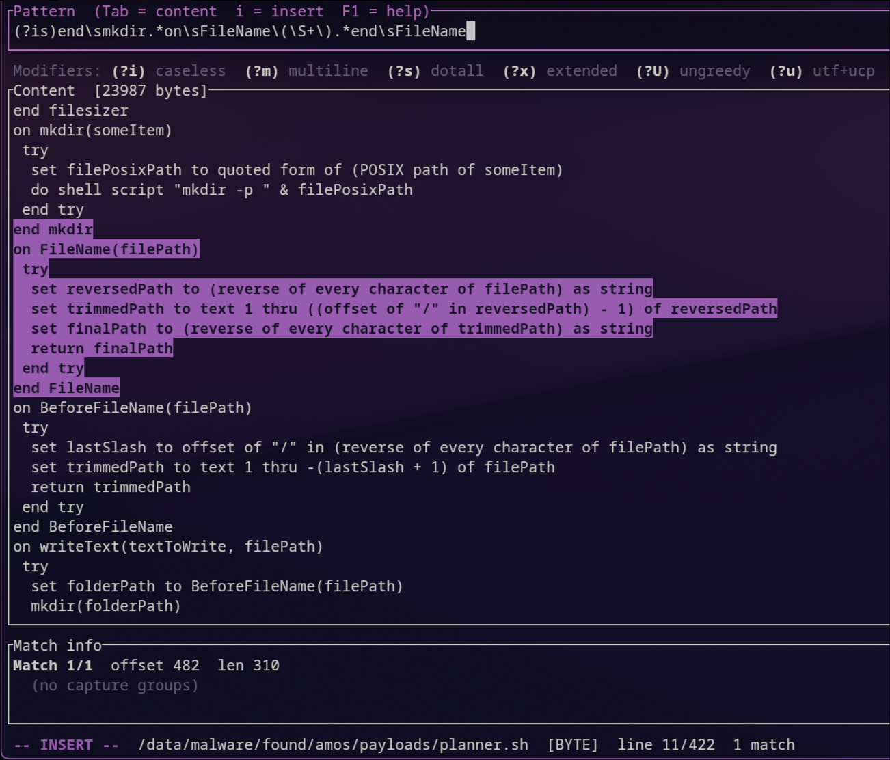

## AI Disclaimer
THIS APPLICATION IS VIBE CODED.
Do not run this application in an environment where security is a priority. Review the code before using it. Clankers do not actually know how to write secure code.

# regexdbg

A terminal UI PCRE2 regex debugger for developing detections against raw byte content — malware samples, shellcode, mixed encodings, binary blobs. Type a pattern, see every match highlighted in the file, inspect capture groups by byte offset.



## Requirements

- Rust (stable, 1.70+)
- libpcre2 — system package:
  - Arch: `pacman -S pcre2`
  - macOS: `brew install pcre2`
  - Debian/Ubuntu: `apt install libpcre2-dev`
- Clipboard utility (for F2 copy):
  - macOS: built-in (`pbcopy` — no install needed)
  - Wayland: `wl-clipboard` (`wl-copy`)
  - X11: `xclip` or `xsel`
- Railroad diagram (for F5):
  - Linux: `xdg-open` (usually pre-installed)
  - macOS: `open` (built-in)

## Build

```bash
git clone <repo>
cd regexdbg
cargo build --release
```

This produces two binaries:
- `target/release/regexdbg` — the TUI
- `target/release/regexdbg-diagram` — the diagram server (launched automatically by F5; must be on `$PATH`)

To install both so F5 works:
```bash
cargo install --path tui
cargo install --path diagram
```

## Usage

```bash
# Load a file
regexdbg sample.bin

# Pipe from stdin (keyboard is read from /dev/tty automatically)
cat sample.bin | regexdbg

# Scratch mode — start with an empty editable buffer
regexdbg
```

## Interface

The UI has two focus areas switched with **Tab**. Both use **vim-style modal editing**.

### Pattern pane

Starts in **Normal mode**. Press `i` / `a` / `A` to enter Insert mode and type a PCRE2 pattern. Matches recompute 150 ms after you stop typing. Press `Esc` to return to Normal mode.

### Content pane

In **file mode** (launched with a path or stdin): read-only, navigation keys only.

In **scratch mode** (no argument): fully editable with vim Normal / Insert / Visual modes. Use it to paste or type raw bytes to test against.

### Match highlights

- **Yellow** — match extent
- **Cyan** — capture group within a match
- **Green/bold** — currently selected match

Non-printable bytes are shown as `\xNN`. Lines split on `0x0A`.

### Match-info panel

Shows the selected match's byte offset and length, plus each capture group: number, name (if named), byte range, and captured bytes (`\xNN`-escaped).

### Modifier bar

A static reference line for all inline modifiers. Write them directly in the pattern — there are no toggles.

### Status line

Shows filename, scroll position, total match count, and the full PCRE2 compile-error message (with pattern offset) when the pattern is invalid. Temporarily replaced by a confirmation or error notification after certain actions; clears after 2 seconds.

## Keybindings

### Global (any focus, any mode)

| Key | Action |
|---|---|
| **F1** | Help overlay (any key closes) |
| **F2** | Copy pattern to system clipboard |
| **F5** | Open live railroad diagram in browser |
| **F12** | Quit |
| **Ctrl+C** / **Ctrl+Q** | Quit |

### Pattern pane — Normal mode

| Key | Action |
|---|---|
| **Tab** / **Enter** | Switch focus to content |
| **i** | Insert before cursor |
| **I** | Insert at start of pattern |
| **a** | Insert after cursor |
| **A** | Insert at end of pattern |
| **v** | Enter Visual mode |
| **h** / **l** / **←** / **→** | Move cursor |
| **w** / **b** / **e** | Word forward / back / end |
| **0** / **^** / **Home** | Jump to start |
| **$** / **End** | Jump to end |
| **x** | Delete character under cursor |
| **D** | Delete to end of pattern |
| **dd** | Delete entire pattern (into yank buffer) |
| **cc** | Change entire pattern (delete + Insert mode) |
| **yy** | Yank entire pattern |
| **p** / **P** | Paste after / before cursor |
| **u** | Undo |

### Pattern pane — Insert mode

| Key | Action |
|---|---|
| **Esc** | Return to Normal mode |
| **Tab** | Switch focus to content |
| **←** / **→** / **Home** / **End** | Move cursor |
| **Backspace** / **Delete** | Delete |
| Any printable character | Insert into pattern |

### Pattern pane — Visual mode

| Key | Action |
|---|---|
| **Esc** | Return to Normal mode |
| **h** / **l** / **w** / **b** / **e** | Extend selection |
| **d** / **x** | Delete selection |
| **y** | Yank selection |
| **c** | Change selection (delete + Insert mode) |

### Content pane — file mode (read-only)

| Key | Action |
|---|---|
| **Tab** / **Enter** / **/** | Switch focus to pattern |
| **j** / **k** / **↓** / **↑** | Scroll one line |
| **f** / **b** / **PgDn** / **PgUp** | Scroll one page |
| **g** / **Home** | Top |
| **G** / **End** | Bottom |
| **n** | Next match |
| **N** | Previous match |
| **F3** | Next match |
| **F4** | Previous match |
| **q** | Quit |

### Content pane — scratch mode, Normal

| Key | Action |
|---|---|
| **Tab** | Switch focus to pattern |
| **i** / **I** / **a** / **A** | Enter Insert mode |
| **o** / **O** | Open line below / above and enter Insert mode |
| **v** | Enter Visual mode |
| **h** / **j** / **k** / **l** / arrows | Move cursor |
| **w** / **b** / **e** | Word forward / back / end |
| **gg** / **G** | Top / bottom |
| **0** / **^** / **Home** | Start of line |
| **$** / **End** | End of line |
| **x** | Delete character |
| **dd** | Delete line |
| **yy** | Yank line |
| **p** / **P** | Paste after / before |
| **u** | Undo |
| **n** / **N** / **F3** / **F4** | Next / previous match |

### Content pane — scratch mode, Insert

| Key | Action |
|---|---|
| **Esc** | Return to Normal mode |
| **Tab** | Switch focus to pattern |
| **Enter** | New line |
| **Backspace** / **Delete** | Delete |
| arrows / **Home** / **End** / **PgUp** / **PgDn** | Navigate |
| Any printable character | Insert into buffer |

## Inline modifiers

Write modifiers directly in the pattern. They can be combined (`(?im)`) or scoped (`(?i)foo(?-i)bar`).

| Modifier | Effect |
|---|---|
| `(?i)` | Caseless — case-insensitive matching |
| `(?m)` | Multiline — `^`/`$` match line boundaries |
| `(?s)` | Dotall — `.` matches `\n` |
| `(?x)` | Extended — ignore unescaped whitespace, allow `#` comments |
| `(?U)` | Ungreedy — all quantifiers lazy by default |
| `(?u)` | UTF+UCP — UTF-8 semantics and Unicode properties (off by default; input is raw bytes) |

## Railroad diagram (F5)

Press **F5** at any time to open a live railroad diagram of the current pattern in your system browser. The diagram updates automatically as you edit the pattern (~500 ms polling). The diagram server (`regexdbg-diagram`) shuts down when the TUI exits.

PCRE2 mode modifiers (`(?i)`, `(?ms)`, etc.) are rendered as literal nodes in the diagram since the underlying visualizer uses JavaScript regex syntax. Named groups (`(?P<name>...)`) are normalized to `(?<name>...)` automatically.

The `regexdbg-diagram` binary must be on `$PATH`. See Build above.

## Architecture

Three crates:

- **`core`** — pure matching logic, no UI dependency. `compile(pattern, flags)` → `CompiledPattern`; `run_matches(&mut compiled, buf)` → `Vec<Match>`. All offsets are byte offsets into the raw buffer.
- **`tui`** — ratatui+crossterm front-end. Calls `core` once per pattern/buffer change and stores the resulting spans; rendering is read-only against those spans. Spawns `regexdbg-diagram` on F5 and kills it on exit.
- **`diagram`** — stdlib-only HTTP server that serves a vendored regexper.js railroad diagram page. Reads the current pattern from a temp file that the TUI updates on each debounced edit. No external dependencies.

## Running tests

```bash
cargo test -p core          # all core tests
cargo test -p core <name>   # single test by name
cargo test -p diagram       # diagram page tests
```
